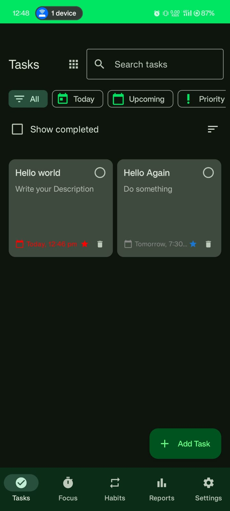
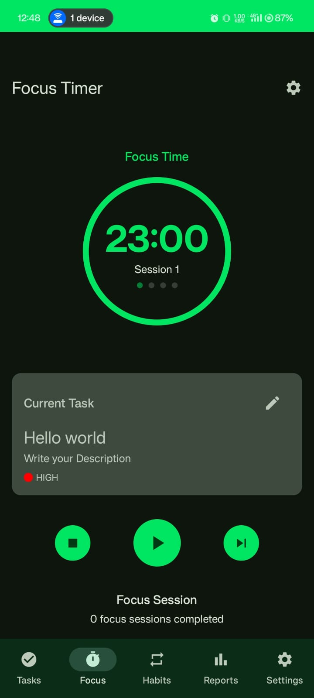
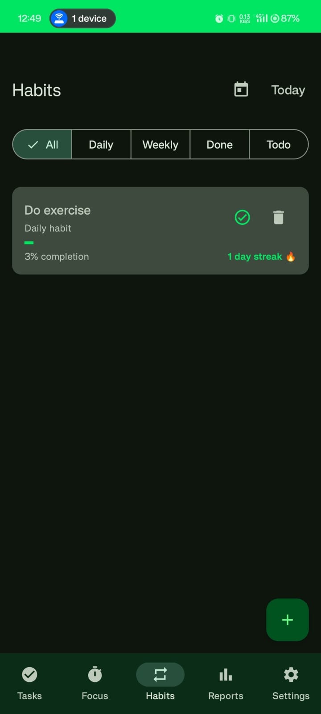
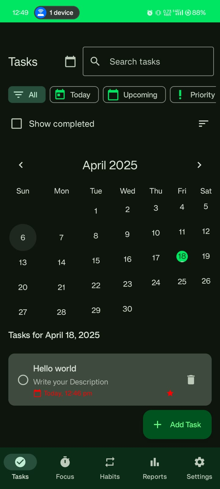
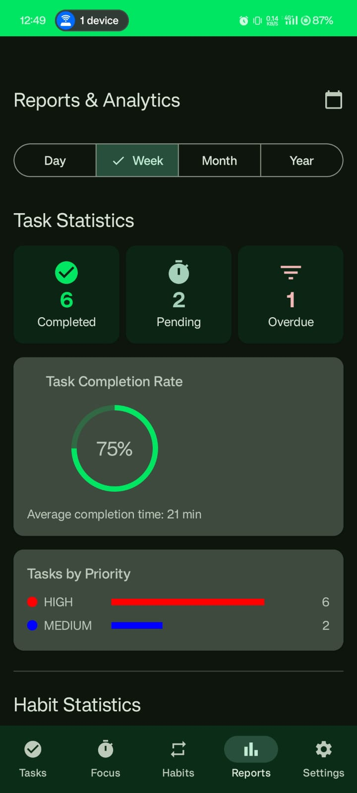
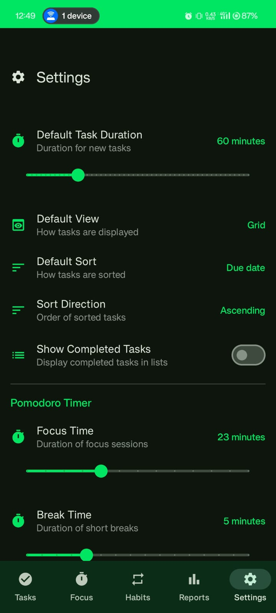

# Task IT- Your Personal Productivity Companion

TaskIt is a beautifully designed productivity app that helps you stay focused, build better habits, manage tasks, and track your progress—all in one place. Whether you're a student, professional, or productivity enthusiast, TaskIT provides the tools you need to organize your day and stay on top of your goals.

---

## 📱 App Screenshots

| Task Screen | Focus Mode | Habit Tracker |
|-------------|-------------|----------------|
|  |  |  |

| Calendar View | Reports | Settings |
|----------------|---------|-----------|
|  |  |  |

---

##  Features

- **Task Management**
  - Add, edit, and organize tasks
  - Categorize by priority and deadlines

- **Focus Mode**
  - Minimize distractions with a Pomodoro-style timer
  - Track how long you stay focused

- **Habit Tracker**
  - Build and maintain positive habits
  - Visualize your consistency with streaks

- **Calendar Integration**
  - View all tasks and events in a monthly calendar
  - Tap on a date to see daily details

- **Progress Reports**
  - Weekly/monthly analytics on task completion and focus time
  - Insights to improve productivity

- **Customizable Settings**
  - Set daily goals and notification reminders
  - Personalize the app appearance and preferences

---
